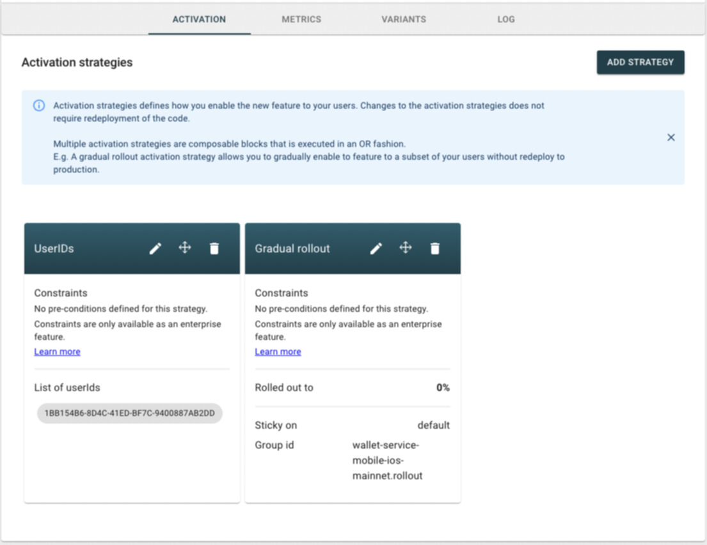
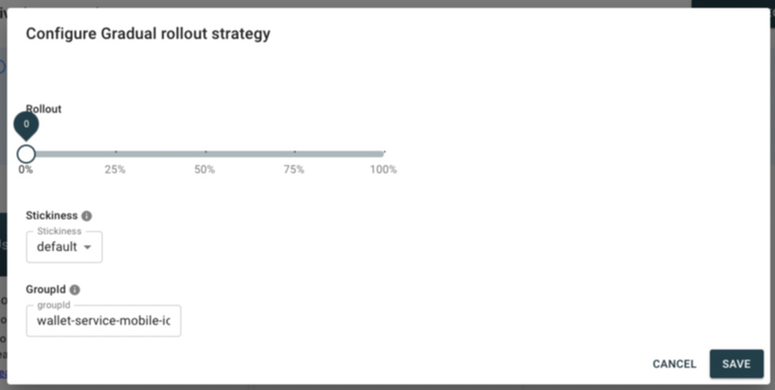

# Feature Toggles

Date: 2022-04-18

## Summary

To control the rollout of the service to our production users on the mobile and and desktop wallets, we use a feature-flag service that will answer "Yes" or "No" for user requests, depending on a list of strategies that we define. Currently, the service we are using is [Unleash](https://www.getunleash.io/)

This document describes the main features we are using and how to interact with it, when needed.

## Feature toggles

We have two [feature toggles](https://docs.getunleash.io/advanced/feature_toggle_types) that are queried by the wallets:

* `wallet-service-mobile.rollout`
* `wallet-service-desktop.rollout`

Those feature toggles are `Release` toggles and represent each wallet and the network they are connected to, e.g. when the mobile wallet on iOS on the `mainnet` wants to know wether to use or not the wallet-service facade, it will request the `wallet-service-mobile-ios-mainnet.rollout` feature-flag that will answer "Yes" or "No" based on a list of strategies.

## Stategies

> It is powerful to be able to turn a feature on and off instantaneously, without redeploying the application. The next level of control comes when you are able to enable a feature for specific users or enable it for a small subset of users. We achieve this level of control with the help of activation strategies. The most straightforward strategy is the standard strategy, which basically means that the feature should be enabled to everyone.

> Unleash comes with a number of built-in strategies (described below) and also lets you add your own custom activation strategies if you need more control. However, while activation strategies are defined on the server, the server does not implement the strategies. Instead, activation strategy implementation is done client-side. This means that it is the client that decides whether a feature should be enabled or not.

**From the unleash docs [here](https://docs.getunleash.io/user_guide/activation_strategy#userids)**

We have a set of strategies configured for each of the feature toggles described above, they are:

1. [UserIDs](https://docs.getunleash.io/user_guide/activation_strategy#userids)

Activates for users with a `userId` defined in the `userIds` list. We are currently using unique device identifiers on the mobile wallets (ios and android) and a random identifier on the desktop wallet (that is stored on the device's storage to persist between restarts).

1. [Gradual rollout](https://docs.getunleash.io/user_guide/activation_strategy#gradual-rollout)

This is a `percentage` based strategy, it will answer the feature toggles depending on the percentage of users that already received a positive or negative answer.

For [stickness](https://docs.getunleash.io/advanced/stickiness), we are currently using `userId` on all the feature toggles, so if an user receives a positive response to the feature toggle request, it will continue receiving a positive response on consecutive requests

### Adding a specific user to the UserID strategy

The mechanism we have for making sure an user always receive a positive response for a feature toggle is by setting his unique identifier on the UserID strategy for the feature toggle his device requests

These are the steps we need to take to add a new user to wallet-service:

1. Ask for the user's unique identifier
2. Ask for the user's operational system
3. Find the correct feature toggle for his OS, device information and network

4. On the feature toggle details page, find the `UserIds` strategy on the `Activation strategies` section

5. Click on the pencil icon to edit it

6. Add the unique identifier using the "Add items" textbox and save
7. Ask for the user to close and re-open his app

### Disabling a feature toggle

The best way to return false to a feature toggle for all our users is to disable the feature toggle entirely, this will ignore all configured strategies and return `false` to all feature toggle requests

A feature toggle can be disabled either through the features list screen on the unleash frontend or on the feature toggle details screen

***Feature toggles list screen***

***Feature toggles details screen***

Our wallets are constantly polling unleash for feature toggle updates, so on the next poll, if the wallet-service feature toggle changed to `false` and it was `true`, it will trigger a reload, sending the user to the old facade.

### Setting a percentage of our user base to use a feature

We have the `gradual rollout strategy` on all of our wallet-service feature toggles, so in order to change the percentage of our total userbase that will receive `true` for the wallet-service facade feature toggle, we need to do the following:

1. Go on the `feature toggles list screen` and find the correct feature flag for the device OS we want to change

2. On the feature toggle details screen, find the `Gradual rollout strategy` and click on the `pen` icon to edit

3. Change the rollout percentage to the target percentage and save

**Notice**: This will not trigger a refresh on the user's apps, they will have to close and open their apps again to load their wallets on the wallet-service facade.
